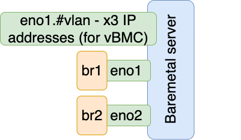
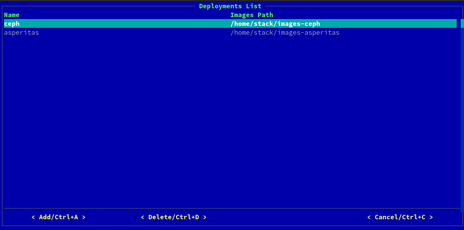

# Подготовка к развёртываниям с нуля

При первоначальном развёртывании строго советуется пройти каждый пункт! 
Asperitas Console не предполагает быстрого старта или прототипного развёртывания! 

Для запуска консоли введите команду в консоли узла развёртывания
~~~shell
asperitas
~~~

Для запуска консоли в режиме **debug** используйте команду 
~~~shell
asperitas --debug
~~~

После выполнения команды появляется **Главное окно** asperitas консоли


## Эмулирование физических узлов

Может сложиться ситуация, когда ресурсов для развертния физическийх узлов недостаточно.
Если физических узлов достаточно, то этот шаг можно пропустить.

Для эмулирования физических узлов используется инструмент [Virtual BMC](https://docs.openstack.org/virtualbmc/latest/).
Инструмент VirtualBMC имитирует [Baseboard Management Controller (BMC)](https://en.wikipedia.org/wiki/Intelligent_Platform_Management_Interface#Baseboard_management_controller), предоставляя [IPMI](https://en.wikipedia.org/wiki/Intelligent_Platform_Management_Interface) доступ к сети и взаимодействуя с libvirt на хосте, на котором работает vBMC.
Virtual BMC управляeт виртуальными машинами, которые притворяются железными (bare metal) серверами.


### Установка операционной системы на железный (bare metal) сервер

Первым шагом необходимо подготовить железный сервер и установить на него операционную систему.
Для этих целей подойдет [admin-point.qcow2](http://10.100.112.30:82/image/devel/admin-point.x86_64.qcow2).


### Подготовка сетевых интерфейсов

Для манипуляций с виртуальными машинами через Virtual BMC необходимо выполнить подготовку сетей на железном сервере.
Понадобится, как минимум, 2 физических интерфейса (см. рис.), каждый из которых подключен к линукс бриджу(linux bridge).
Так же необходимо настроить виртуальный интерфейс с 3мя IP адресами (для 3х compute nodes). Этот интерфейс должен быть
в том же VLAN, что и ctlplane сеть на undercloud'e.



Все дальнейшие манипуляции с сетевыми интерфейсами и линукс бриджами производятся с помощью network-scripts.
Ниже приведены конфигурационные файлы всех необходимых интерфейсов и линукс бриджей.

`cat /etc/sysconfig/network-scripts/ifcfg-eno1`
```
TYPE=ethernet
BOOTPROTO=none
NAME=eno1
DEVICE=eno1
ONBOOT=yes
BRIDGE=br1
DELAY=0
NM_CONTROLLED=0
```

`cat /etc/sysconfig/network-scripts/ifcfg-eno1.73`
```
DEVICE=eno1.73
BOOTPROTO=none
ONBOOT=yes
IPADDR0=192.178.1.1
NETMASK0=255.255.255.0
IPADDR1=192.178.1.2
NETMASK1=255.255.255.0
IPADDR2=192.178.1.3
NETMASK2=255.255.255.0
VLAN=yes
VLAN_ID=10
PHYSDEV=eno1
```

`cat /etc/sysconfig/network-scripts/ifcfg-eno2`
```
TYPE=ethernet
BOOTPROTO=none
NAME=eno2
DEVICE=eno2
ONBOOT=yes
BRIDGE=br2
DELAY=0
NM_CONTROLLED=0
```

`cat /etc/sysconfig/network-scripts/ifcfg-br1`
```
DEVICE=br1
TYPE=Bridge
BOOTPROTO=none
IPADDR=192.168.24.236
GATEWAY=192.168.24.1
NETMASK=255.255.255.0
ONBOOT=yes
DELAY=0
NM_CONTROLLED=0
```

`cat /etc/sysconfig/network-scripts/ifcfg-br2`
```
DEVICE=br2
TYPE=Bridge
BOOTPROTO=none
IPADDR=10.100.113.2
GATEWAY=10.100.115.254
NETMASK=255.255.252.0
ONBOOT=yes
DELAY=0
NM_CONTROLLED=0
```

Далее нужно отключить NetworkManager

`sudo systemctl stop NetworkManager`
`sudo systemctl disable NetworkManager`

И перезагрузить службу сетей

`systemctl restart network`

После завершения конфигурирования сетевых интерфейсов они должны выглядеть подобным образом:
`ip a`
```
1: lo: <LOOPBACK,UP,LOWER_UP> mtu 65536 qdisc noqueue state UNKNOWN group default qlen 1000
    link/loopback 00:00:00:00:00:00 brd 00:00:00:00:00:00
    inet 127.0.0.1/8 scope host lo
       valid_lft forever preferred_lft forever
    inet6 ::1/128 scope host
       valid_lft forever preferred_lft forever
2: eno1: <BROADCAST,MULTICAST,UP,LOWER_UP> mtu 1500 qdisc mq master br1 state UP group default qlen 1000
    link/ether 00:25:90:bb:0e:52 brd ff:ff:ff:ff:ff:ff
    inet6 fe80::225:90ff:febb:e52/64 scope link
       valid_lft forever preferred_lft forever
3: eno2: <BROADCAST,MULTICAST,UP,LOWER_UP> mtu 1500 qdisc mq master br2 state UP group default qlen 1000
    link/ether 00:25:90:bb:0e:53 brd ff:ff:ff:ff:ff:ff
    inet6 fe80::225:90ff:febb:e53/64 scope link
       valid_lft forever preferred_lft forever
4: br1: <BROADCAST,MULTICAST,UP,LOWER_UP> mtu 1500 qdisc noqueue state UP group default qlen 1000
    link/ether 00:25:90:bb:0e:52 brd ff:ff:ff:ff:ff:ff
    inet 192.168.24.236/24 brd 192.168.24.255 scope global br1
       valid_lft forever preferred_lft forever
    inet6 fe80::225:90ff:febb:e52/64 scope link
       valid_lft forever preferred_lft forever
5: br2: <BROADCAST,MULTICAST,UP,LOWER_UP> mtu 1500 qdisc noqueue state UP group default qlen 1000
    link/ether 00:25:90:bb:0e:53 brd ff:ff:ff:ff:ff:ff
    inet 10.100.113.2/22 brd 10.100.115.255 scope global br2
       valid_lft forever preferred_lft forever
    inet6 fe80::225:90ff:febb:e53/64 scope link
       valid_lft forever preferred_lft forever
12: eno1.73@eno1: <BROADCAST,MULTICAST,UP,LOWER_UP> mtu 1500 qdisc noqueue state UP group default qlen 1000
    link/ether 00:25:90:bb:0e:52 brd ff:ff:ff:ff:ff:ff
    inet 192.178.1.1/24 brd 192.178.1.255 scope global eno1.73
       valid_lft forever preferred_lft forever
    inet 192.178.1.2/24 brd 192.178.1.255 scope global secondary eno1.73
       valid_lft forever preferred_lft forever
    inet 192.178.1.3/24 brd 192.178.1.255 scope global secondary eno1.73
       valid_lft forever preferred_lft forever
    inet6 fe80::225:90ff:febb:e52/64 scope link
       valid_lft forever preferred_lft forever
```

### Настройка интерфейса на Undercloud для работы с vBMC

На Undercloud'е необходимо настроить интерфейс в том же VLAN и задать ему IP адрес из тоже же подсети,
которая предназначена для vBMC.

`cat /etc/sysconfig/network-scripts/ifcfg-enp1s0.73`
```
DEVICE=enp1s0.73
BOOTPROTO=none
ONBOOT=yes
IPADDR=192.178.1.4
NETMASK=255.255.255.0
VLAN=yes
VLAN_ID=10
```

После этого необходимо удостовериться, что интерфейсы на switch'e подключены к тому же VLAN и ping проходит до виртуального
интерфейса на железном сервере.

### Загрузка виртуальных машин для эмуляции

После всех манипуляций необходимо загруить 3 виртуальные машины на железном сервере, который был подготовлен ранее.
Для каждой виртуальной машины необходимо изменить параметр `--name` и `--disk`, чтобы имена не повторялись. В дальнейшем
это поможет в случае отладки.

```
virt-install \
        --virt-type=kvm --name virt-ctl-1 \
        --ram 12288 --vcpus=4 \
        --os-variant=centos-stream8  \
        --network=bridge=br1 --network=bridge=br2  \
        --disk path=/var/lib/libvirt/images/virt-ctl-1.qcow2,size=200,format=qcow2 \
        --autostart --pxe --noautoconsole
```

Параметр `--pxe` позволяет использовать протокол загрузки PXE для загрузки исходного виртуального диска и ядра для 
запуска процесса установки на виртуальной машине.

Посмотреть созданные виртуальные машины можно с помощью команды `virsh list --all`.


### Подготовка Virtual BMC

Если Virtual BMC не установлена на железном сервере, установите ее следуя [инструкции](https://docs.openstack.org/virtualbmc/latest/install/index.html).

Virtual BMC должен быть запущен от пользователя `root`.
Иногда возникается проблема, когда невозможно запустить `vbmcd` от имени пользователя `root`:
```
ERROR VirtualBMC [-] server PID #0 still running 
```
Это решается удалением файла ~/.vbmc/master.pid


### Добавление виртуальных машин в Virtual BMC

Ранее созданные виртуальные машины должны быть добавлены vbmc. 
Пример для одной виртуальной машины:
```
vbmc add virt-ctl-0 --address 192.178.1.1 --username admin --password admin
```
IP адрес задается из ранее созданного виртуального интерфейса.

После добавления виртуальных машин в vbmc их неоходимо запустить:
```
vbmc start virt-ctl-0
```
С помощью команды `vbmc list` можно проверить статус добаленных виртуальных машин.

Далее можно переходить к следующему пункту и добавлять виртуальные машины как физические узлы.
В качестве IP адреса необходимо указывать IP адрес заданный при добавлении виртуальной машины в vbmc.
Логин и пароль задается такой же как при добавлении виртуальной машины в vbmc,
mac адрес можно получить из следующей команды `virsh domiflist virt-ctl-0 | grep br1 | sed 's/  */ /g' | cut -d' ' -f 6`


## Физические узлы 

Перейдите во вкладку _Baremetal nodes_. 
Нажмите кнопку _Add_, чтобы добавить новый физический узел для добавления в развёртываемое облако.


Красным цветом выделены поля обязательные для заполнения.

* _Name_ -  имя физического узла. Используется лишь для удобства, не влияет на hostname узла;
* _BMC type_ - тип BMC, поддерживаемые значения: _IPMI_, _iDRAC_;
* _BMC address_ - IP-адрес BMC, пример: _2.3.4.5_ ;
* _BMC login_ - логин для управления физическим узлом через BMC;
* _BMC password_ - пароль для управления физическим узлом через BMC;
* _Profile_ - роль физического узла в развёртываемом облаке; 
* _UEFI boot mode_ - установите галочку, если узел загружается в режиме UEFI;
* _PXE port mac_address_ - мак адрес физического порта узла, через который происходит загрузке по PXE.

Поля необязательные для заполнения (используются, если интроспекция узла нежелательна):
* _Disk capacity_ - размер физического диска для установки операционной системы;
* _Cpu number_ - число процессорных ядер узла;
* _Architecture_ - архитектура процессора (поддерживается только x86_64);
* _Memory capacity_ - размер оперативной памяти узла.

Нажмите кнопку _Save_. Физический узел добавится в список физических узлов. 
При добавлении физического узла узел не включается и вводится в развёртываемое облако.

Дождитесь изменения статуса узла на _manageable/available_. 
Если узел остаётся в статусе enroll, перейдите в раздел "Исправление проблем". 

Статус _manageable_ позволяет включать и выключать узел из системы на узле развёртывания. 
Статус _available_ позволяет ввести машину в развёртываемое облако. 
Система автоматически переводит узел в состояние _available_, если известны параметры _Disk capacity_, _Cpu number_, _Architecure_ и _Memory capacity_.

## Интроспекция

Перейдите во вкладку _Introspection_ Главного меню. 


На экране отобразится список физических машин, добавленных в предыдущем пункте.

Отметьте весь список машин и нажмите кнопку _Start_. Начнётся интроспекция физических узлов. Статус отображается в правой половине экрана. 

После успешного окончания интроспекции напротив поле _state_ будет равно значению _finished_, а напротив имени узла появится галочка. 

Статус отображается только для одного узла. Чтобы посмотреть статус для другого узла, нажмите на имя узла. 

После успешной интроспекции можно посмотреть собранные данные дважды нажав мышкой на имя узла. Если мышки нет, то при помощи кнопок наведитесь на имя узла и нажмите _Enter_


 
## Порядок физических интерфейсов

_! Опция доступна только после успешной интроспекции_

Перейдите во вкладку _Network interfaces order_. 


На экране отобразится список узлов и их интерфейсов. Порядок интерфейсов важен, так как далее сетевые планы строятся только по номерами интерфейсов, а не их именам. Поэтому определите порядок так, чтобы интерфейсы всех узлов с одним порядковым номером были настроены одинаково на физических коммутаторах в вашей серверной.  

## Диск операционной системы

_! Опция доступна только после успешной интроспекции_

Перейдите во вкладку _Server root disk_. 


Если у какого-либо физического узла несколько дисков, то необходимо указать правильный диск для установки операционной системы. 
Иначе система выберет физический диск случайным образом.  

## Физические порты 

Перейдите во вкладку _Baremetal ports_. 


Здесь отображаются все физические порты известные системе для загрузки по PXE. 
Первоначально создаётся порт указанный при создании физической машины. Затем после интроспекции добавляется порт, по которому произошла загрузка по PXE, 
**если этот порт не совпал с указанным вами при создании**. 

Если это произошло, то необходимо оставить один порт в системе и удалить ненужный! Иначе при развёртывании порт для загрузки будет выбран случайным образом из этих двух.  

## Сети

Перейдите во вкладку _Networks_. 


В системе Asperitas используется принцип разделения сетей на роли. 
Набор заранее заданных сетей, который обязан присутствовать в системе: 

* _Ctlplane_ - сеть администрирования физических узлов в развёртываемом облаке. 
Это единственная сеть, по которой разрешён SSH доступ к физическим узлам облака. 
* _External_ - сеть для доступа к публичному API развёртываемого облака. 
Сеть должна быть доступна для всех пользователей облака. 
* _InternalApi_ - сеть для доступа к приватному API развёртываемого облака. 
Используется сервисами облака для общения друг с другом. 
Не должна быть доступна даже с узла развёртывания. 
* _Storage_ - сеть для доступа сервисов облака к хранилищу: Ceph или Nfs.

Набор заранее заданных опциональных сетей, их можно удалить из системы за ненадобностью:
* _InternalCeph_ - внутренняя сеть для узлов хранения Ceph.
* _IronicProvisioning_ - сеть для захвата физических узлов сервисом Ironic развёртываемого облака. 
Если сервис не используется, то сеть не нужна.  

Можно изменить параметры сети, нажав на сеть в списке сетей двумя кликами мыши или кнопной _Enter_.


Если необходима дополнительная сеть, то можно добавить новую, нажав кнопку _Add_.

Если в поле _Exists_ стоит галочка, то сеть уже создана в системе и её нельзя удалить из списка сетей. 

Сеть создаётся при развёртывании в дальнейшем и удаляется, если удаляется развёртывание. 

## Шаблоны развёртывания 

Перейдите во вкладку _Deployment templates_. 



При чистом старте - таблица будет пустая. Нажмите кнопку _Add_, чтобы добавить новое развёртывание. 

В появившемся окне вы можете выбрать один из заранее заданных типов развёртывания: _OpenStack_ или _Ceph_, или выбрать _No_.

Если OpenStack планируется развернуть **без Ceph**, то создайте единственное развёртывание типа _OpenStack_.

Если OpenStack планируется развернуть **с Ceph**, то создайте сначала развёртывание _Ceph_, затем _OpenStack_


Заполните имя развёртывания в поле _Name_. Имя будет использоваться как часть hostname физических узлов.

В поле _Images Path_ из выпадающего списке выберите образ операционной системы, используемой для развёртывания. 
Как правило для типа _Ceph_ используются образы _images-ceph_, а для типа _OpenStack_ используются образы _images-asperitas_. 
Если ваш путь к образам отличается от тех, что даются на выбор, то поставьте галочку в поле _set if custom image is used_ и укажите путь к образам в поле ниже. 

На данном этапе при создании развёртывания создаются только шаблоны для настройки развёртываемого облака. 
Никаких изменений с физическими машинами не происходит.

На главном экране asperitas консоли в секции _Deployments_ появятся ваши созданные развёртывания для настройки. 
