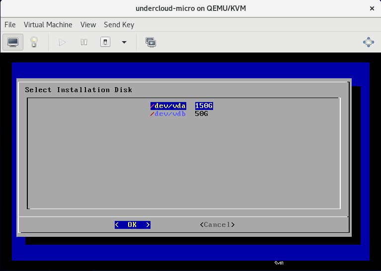
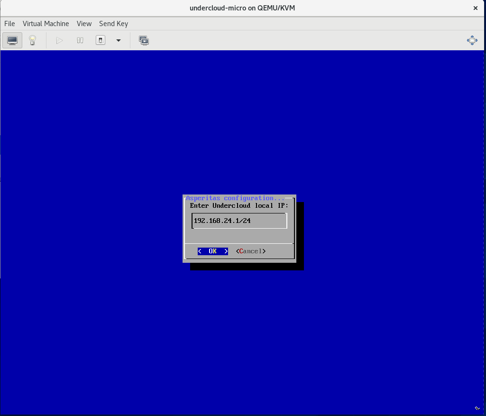
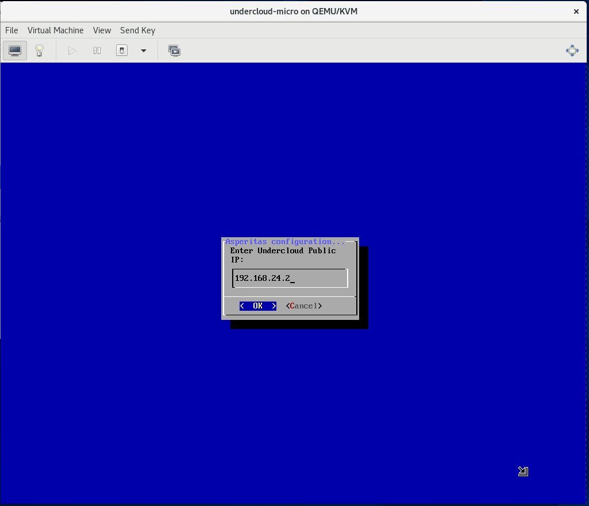
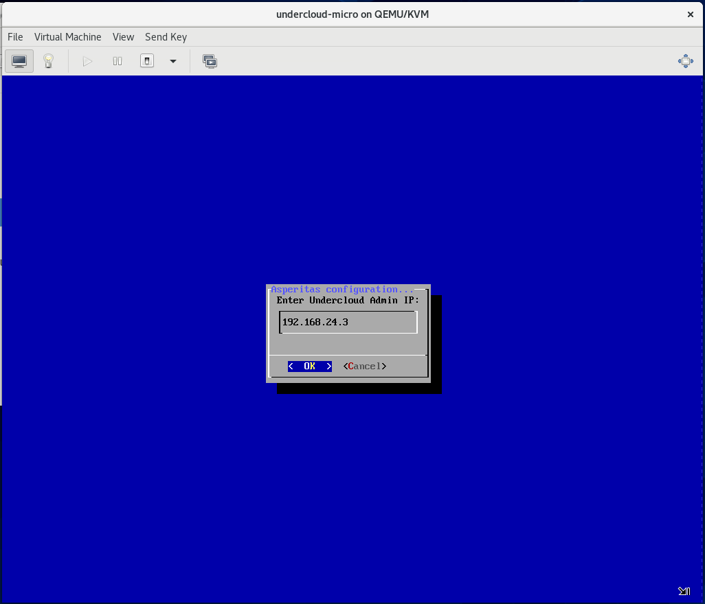
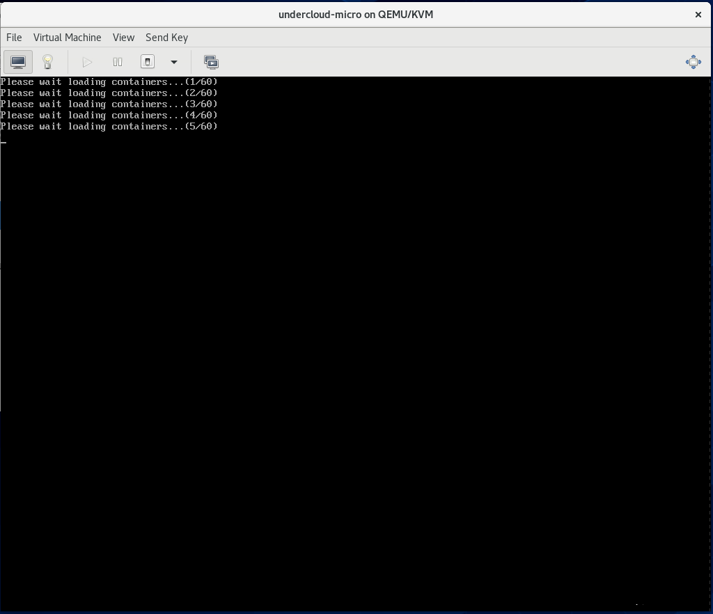
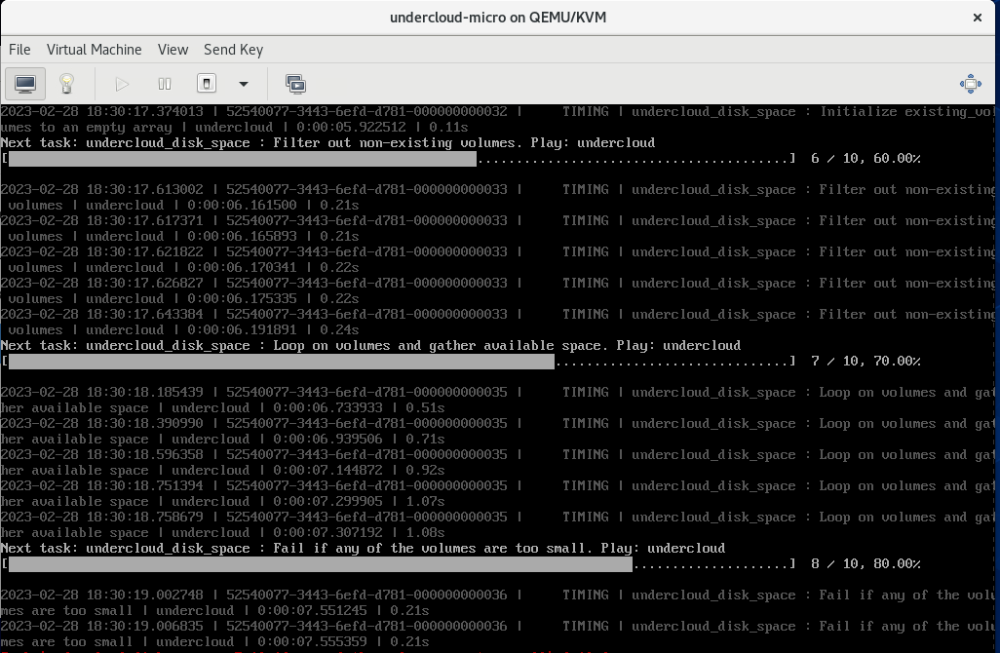

# Установка узла развёртывания

Дистрибутив распространяется на переносимом цифровом носителе, на котором располагается файл undercloud.iso или установщик для образа узла развёртывания. 

* При установке узла на физический узел - вставьте флешку с установщиком в компьютер и загрузитесь в неё с физического узла. 
* При установке на физический узел через BMC по сети Интернет - примонтируйте файл _undercloud.iso_ через виртуальную консоль BMC и загрузитесь в Virtual CD узла. 
* При установке узла развёртывания в виртуальной машине следуйте инструкциям ниже 

## Установка в виртуальной машине (Centos 7,8) 

Установите необходимые пакеты на узел 
~~~shell
sudo dnf install -y bridge-utils
sudo dnf install -y qemu-kvm qemu-img virt-manager virt-viewer python3-libvirt libvirt libvirt-client libguestfs libguestfs-tools virt-install libgcrypt libxcrypt
~~~

Для виртуальной машины узла развёртывания необходимо создать два бриджа и указать их при создании виртуальной машины KVM. 
Внутри ВМ они будут светиться как два интерфейса: один используется для внутренней сети настройки облачной платформы, а второй используется для доступа к узлу развёртывания.  

Создать мост для интерфейса, на котором планируется запустить KVM VM при помощи _network-scripts_
~~~shell
nano /etc/sysconfig/network-scripts/ifcfg-eno1
~~~
~~~
DEVICE=eno1
ONBOOT=yes
HOTPLUG=no
NM_CONTROLLED=no
MTU=1500
BOOTPROTO=none
BRIDGE=br-eno1
TYPE=Ethernet
~~~
~~~shell
nano /etc/sysconfig/network-scripts/ifcfg-br-eno1
~~~
~~~
DEVICE=br-eno1
ONBOOT=yes
TYPE=Bridge
DELAY=0
BOOTPROTO=static
IPADDR=192.168.24.64
NETMASK=255.255.255.0
NM_CONTROLLED=no
DEFROUTE=no
~~~

Или создайте мост при помощи Linux утилиты _ip_
~~~shell
ip link add link eno1 name eno1.100 type vlan id 100
ip link set eno1.100 up
ip link add br100 type bridge 
ip link set eno1.100 master br100
ip link set br100 up
~~~

Для проверки настроек можно использовать 
~~~shell
sudo brctl show
~~~

Для запуска ВМ выполните
~~~shell
virt-install --virt-type=kvm --name undercloud-base --ram 32768 --vcpus=16 --os-variant=centos8 --cdrom=/var/lib/libvirt/boot/undercloud.iso --network=bridge=br-eno1 --network=bridge=br-eno2 --disk path=/var/lib/libvirt/images/undercloud-base.qcow2,size=150,format=qcow2
~~~

KVM создаст виртуальные интерфейсы vnet0 и vnet1 в составе бриджей, если бридж падает, то интерфейсы из него исчезают. Чтобы добавить снова их в бридж можно выполнить
~~~shell
ip link set vnet1 master br-eno2
~~~

## Процесс установки 

После загрузки с диска установки вы увидите на экране сервера выбор диска для установки операционной системы AsperitOS. 

Дождитесь загрузки и проверки _undercloud.raw_. 

Затем выберите интерфейс для сети администрирования физических узлов. 
Интерфейс не должен использоваться для доступа к узлу разёртывания!  

На картинке вы видете два интерфейса. 
Предварительно на них был запущен автоматически DHCP клиент.
Первый интерфейс используется как сеть администрирования, поэтому в сети не было DHCP сервера. 
Второй интерфейс используется для доступа к узлу развёртывания. В этой сети есть DHCP сервер, который выдал адрес узлу развёртывания.

Затем введите CIDR для сети администрирования. Важно! После установки сеть будет поменять очень сложно. Поэтому заранее продумайте сети вашей системы!

Введите локальный (основной) IP-адрес узла развёртывания. 
Узел развёртывания имеет 3(!) адреса так как сам является отдельной облачной средой на базе OpenStack. 
3 адреса необходимы для 3 точек доступа к облачным сервисам узла развёртывания: публичной, внутренней точки доступа и точки администратора. 
Локальный IP-адреса считается как внутрення точка доступа в системе.

Введите IP-адрес шлюза для сети администрирования. По умолчанию - это локальный IP-адрес узла развёртывания. 
Но можно указать и другой адрес для вашей сети администрирования.

В сети администрирования узел развёртывания запускает DHCP сервер для раздачи адресов физическим узлам облака. 
Это обязательно, поэтому в этой сети не может быть внешнего другого DHCP сервера во избежание проблем. 
Введите начало и конец множества IP-адресов, которые будут назначены вашим физическим машинам. 
Учтите, что в этой сети заранее заняты 4 адреса для узла развёртывания: 3 указываются вручную, 1 выбирается случайным образом (как правило .5 адрес). 
А также дальше необходимо будет указать ещё одно множество для адресов интроспектирования физических узлов.  

В сети администрирования узел развёртывания запускает ещё один DHCP сервер, который используется для интроспекции физических узлов. 
Множество указанных вами IP-адресов влияет только на количество одновременно интроспектируемых узлов. 
Эти адреса назначаются узлам временно и не сохраняются в дальнейшем. 

Введите публичный IP-адрес для узла развёртывания. Используется для доступа к API облачных сервисов на узле развёртывания. 

Введите IP-адрес для точки доступа администратора на узле развёртывания. 

Введите DNS сервер(а) для узла развёртывания. Если несколько, то перечислите их через запятую. 

Введите NTP сервер(а) для узла развёртывания. Если несколько, то перечислите их через запятую. 

Дождитесь загрузки контейнеров в локальный реестр контейнеров на узле развёртывания. 

Дождитесь установки облачной системы на базе OpenStack на узел развёртывания. 

Ваш узел развёртывания готов!
