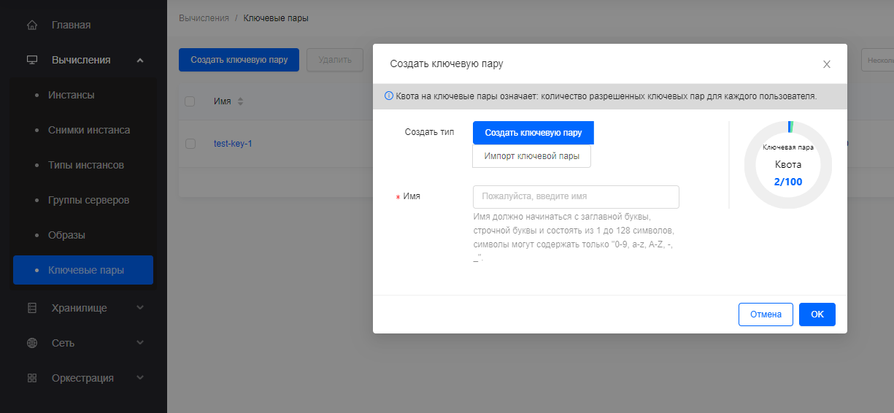
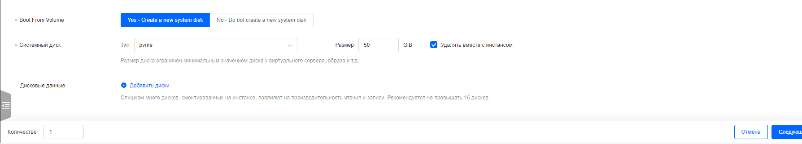
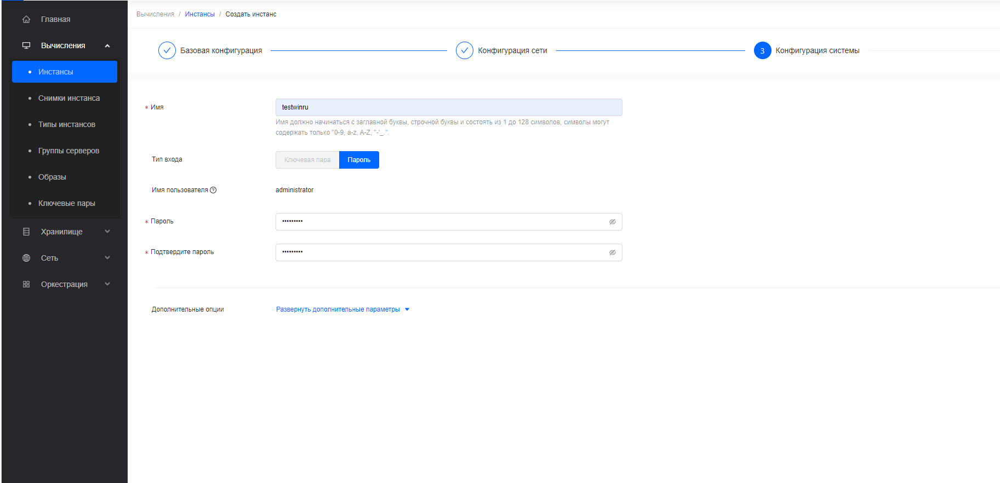

# Запуск и управление инстансами (вкладка Вычисления)

Сервис OpenStack Вычисления предоставляет возможность развертывания инстансов (виртуальных машин). В случае необходимости в более подробной
информации смотрите [Руководство OpenStack Nova](https://docs.openstack.org/nova/latest/).

## Создание пары ключей

Для управления и входа в создаваемые инстансы можно использовать пароли
(задаются на этапы создания инстанса) или ключевые пары (в системе используются ключи ssh; под ключевой парой подразумевается публичный и закрытый ключ из пары ssh-ключей). Ключевая пара может использоваться для входа *nix-like систему и для безопасной расшифровки пароля в Windows системах, если он был задан таким способом.

1.  Войдите в дашборд.
2.  Выберите соответствующий проект из меню переключения проектов в верхнем левом углу. 

3.  На странице `Консоль` откройте вкладку `Вычисления` и нажмите на категорию `Ключевые пары` .

4.  Нажмите `Создать пару ключей`.
5.  В диалоговом окне `Создать ключевую пару` выберите один из вариантов `Создать тип` :
    -   `Создать ключевую пару`: Если выберете этот вариант, введите `Имя`
    -   `Импорт ключевой пары`: Если выберете этот вариант, появится новое поле для `Публичный ключ` . Введите `Имя` вашей ключевой пары, скопируйте публичный ключ в поле `Публичный ключ` .
6.  Нажмите `OK`. Дашборд отобразит ключевую пару на вкладке `Ключевые пары` .

## Запуск инстанса

1.  Войдите в дашборд.
2.  Выберите соответствующий проект из меню Switch Project в верхнем левом углу.
3.  На странице `Консоль` откройте вкладку `Вычисления` и нажмите на категорию `Инстансы` .

4.  Нажмите `Создать инстанс`.

5.  На странице `Создание инстанса` введите следующие значения для запускаемого инстанса.

    - `Зона доступности` : Зона доступности, в которой будет запущен сервер. В случае с облаками малого размера можно ничего не выбирать.

    
    

    - `Спецификация` : Выберите конфигурацию для вашего инстанса, исходя из вычислительных потребностей.
    

    - `Источник запуска` : Выберите один из следующих вариантов:

        -   Образ: Если выберете этот вариант, появится новое поле для `Операционная система` . Вы можете выбрать образ из списка. И введите размер диска, используемого как `Системный диск` инстанса.

        

            > **Важное замечание**
            > 
            > Выберите вариант `Удалять вместе с инстансом`, чтобы удалить диск при удалении инстанса. Эта опция позволяет избегать замусоривания хранилища блочных устройств. 
            >
            > 
            > В то же время, сохранять диск после удаления инстанса может быть полезно, если в дальнейшем необходимо создать новый инстанс с этим системным диском. Будьте внимательны, это очень важная настройка.

        -   Снимок инстанса: Используя этот вариант, вы можете загрузиться с снимка диска и создать новый диск, выбрав `Снимок инстанса` из списка.

        -   Загрузочный диск: Если выберете этот вариант, появится новое поле для `Загрузочный диск` . Вы можете выбрать диск из списка.

    - `Данные диска` : Диски, подключенные к инстансу.

6.  Нажмите `Далее: Конфигурация сети`

    Вы можете выбрать `Сети` , `Порты` или их комбинацию для сетевой конфигурации инстанса.

    - `Сети` : Добавьте сеть к инстансу. Если вы указываете сети, `Виртуальная локальная сеть (VLAN)` и `Группа безопасности` являются обязательными полями.

    

    - `Виртуальная локальная сеть (VLAN)` : Укажите подсеть сети и назначьте фиксированный IP адрес автоматически или вручную для инстанса.

    `Группа безопасности`: Группы безопасности - это вид облачного файервола, который определяет, какой входящий сетевой трафик перенаправляется на инстансы.

    

    `Порты`: Активируйте порты, которые вы хотите назначить инстансу.

7.  Нажмите `Далее: Конфигурация системы`.

    `Имя`: Имя сервера.

    `Тип входа в систему`: Выберите один из следующих вариантов:

    -   Пара ключей: Если выберете этот вариант, появится новое поле для `Пара ключей`. Пара ключей позволяет вам подключиться по SSH к вашему вновь созданному инстансу. Вы можете выбрать существующую пару ключей, импортировать пару ключей или создать новую пару ключей.
    -   Пароль: Введите `Пароль для входа` и подтвердите его. И вы можете войти в инстанс, используя пароль.
    
    

8.  Нажмите `Далее: Подтверждение конфигурации` и подтвердите свой выбор.

    Инстанс создается и вы можете подождать несколько секунд, чтобы следить за изменениями списка данных инстанса или вручную обновить данные, чтобы получить окончательный результат отображения.

## Создание снимка инстанса

1.  Войдите в дашборд.
2.  Выберите соответствующий проект из меню Switch Project в верхнем левом углу.
3.  На странице `Консоль` откройте вкладку `Вычисления` и нажмите на категорию `Инстансы`.
4.  Выберите инстанс для создания с него снимка.
5.  В столбце `Действие` выберите `Резервное копирование и снимки` и нажмите `Создать снимок`.
6.  В диалоговом окне `Создание снимка инстанса` введите имя снимка.
7.  Нажмите `OK`.

    Дашборд покажет новый снимок инстанса на вкладке `Снимки инстансов`.

## Управление состоянием инстанса

1.  Войдите в дашборд.
2.  Выберите соответствующий проект из меню Switch Project в верхнем левом углу.
3.  На странице `Консоль` откройте вкладку `Вычисления` и нажмите на категорию `Инстансы`.
4.  Выберите инстанс, для которого вы хотите изменить состояние.
5.  В столбце `Действие` инстанса нажмите `Статус инстанса` и выберите статус.

## Назначение плавающего IP-адреса инстансу

1.  Войдите в дашборд.
2.  Выберите соответствующий проект из меню Switch Project в верхнем левом углу.
3.  На странице `Консоль` откройте вкладку `Вычисления` и нажмите на категорию `Инстансы`.
4.  В столбце `Действие` выберите `Связанные ресурсы` и нажмите `Назначить плавающий IP`.
5.  В диалоговом окне `Назначение плавающего IP` выберите `IP инстанса` и `Плавающий IP-адрес`.
6.  Нажмите `OK`.

> **Важное замечание**
> 
> Чтобы отменить назначение IP-адреса инстансу, нажмите кнопку `Отменить назначение плавающего IP`.

## Загрузка образа

Образы используются для создания виртуальных машинных инстансов в облаке. Для получения более подробной информации о создании файлов образов смотрите [Руководство OpenStack Glance](https://docs.openstack.org/glance/latest/).

1.  Войдите в дашборд.
2.  Выберите соответствующий проект из меню Switch Project в верхнем левом углу.
3.  На странице `Консоль` откройте вкладку `Вычисления` и нажмите на категорию `Образы`.
4.  Нажмите `Создать образ`.
5.  На странице `Создание образа` введите следующие значения:

    `Имя`: Имя образа.

    `Тип загрузки`: Выберите один из следующих вариантов:

    -   Загрузить файл: Если выберете этот вариант, нажмите `Нажмите для загрузки` чтобы загрузить двоичный файл данных образа.
    -   URL файла: Если выберете этот вариант, введите `URL файла`.

    `Формат`: Выберите формат образа (например, QCOW2) для образа.

    `ОС`: Выберите операционную систему образа (например, CentOS).

    `Версия ОС`: Версия операционной системы образа.

    `Админ ОС`: Имя администратора операционной системы образа. В общем случае, administrator для Windows, root для Linux.

    `Мин. системный диск (ГБ)`: Количество дискового пространства в ГБ, необходимое для загрузки образа.

    `Мин. память (ГБ)`: Количество памяти в ГБ, необходимое для загрузки образа.

    `Защищенный`: Защита образа от удаления.

    `Тип использования`: Выберите тип использования (например, Общий сервер) для образа.

    `Описание`: Человеко-читаемое описание ресурса.

6.  Нажмите `Подтвердить`.

    Образ ставится в очередь на загрузку. Может потребоваться некоторое время, прежде чем статус изменится с Очереди на Активный.
