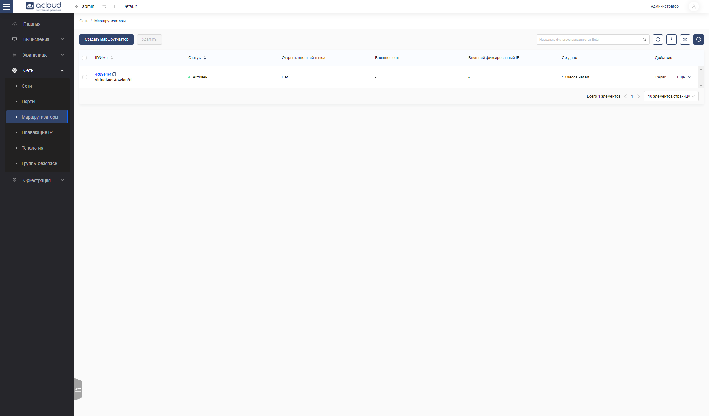
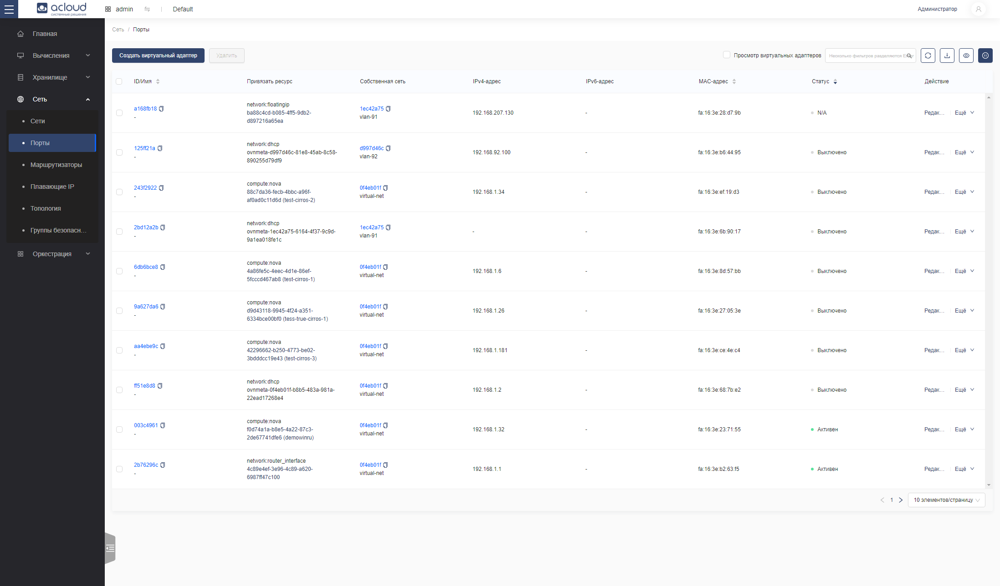
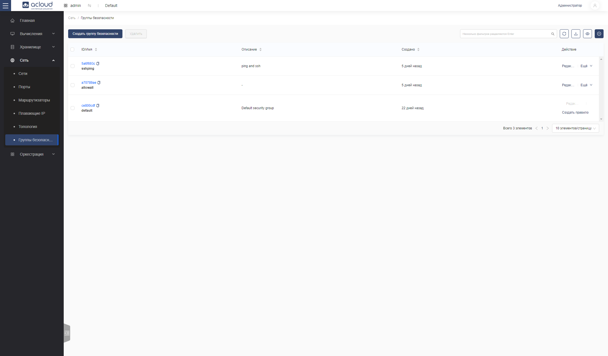

# Создание и управление сетями (Вкладка "Сеть")

Сервис сетевых функций предоставляет систему для управления сетевой связностью в пределах развертывания облака. Он обрабатывает создание и управление виртуальной сетевой инфраструктурой, включая сети, коммутаторы, подсети, маршрутизаторы и виртуальный фаервол.

Этот раздел предоставляет базовые инструкции по созданию сетей и виртуальных маршрутизаторов. Для подробной информации об управлении сетями обратитесь к `Руководству по сетям OpenStack <https://docs.openstack.org/neutron/latest/admin/>`.

## Создание сети

1. Войдите в панель управления.

2. Выберите соответствующий проект из меню переключения проекта в верхнем левом углу.

3. На странице "Консоль" откройте вкладку "Сеть" и нажмите на категорию "Сети".

4. Нажмите "Создать сеть".

5. В диалоговом окне "Создать сеть" укажите следующие значения:

   - Имя сети: Укажите имя для идентификации сети.

   - Описание.

   - Общий доступ: Поделитесь сетью с другими проектами. Пользователям у которых не прав администратора не разрешено устанавливать опцию общего доступа.

   - Зона доступности: Выберите зону доступности для сети.

   - Включение безопасности портов: Выберите статус безопасности портов сети. Во включенном состоянии происходит контроль состояния сетевых портов (соответствие IP-адресов MAC-адресам; функции фаервола). В выключенном состоянии сетевой порт никак не контролируется облачной средой.

   - Создать подсеть: Отметьте этот флажок, чтобы создать подсеть.

   Если вы не укажете подсеть при создании сети, то сеть не сможет быть присоединена к инстансу, поскольку для присоединения нужен будет конкретный адрес из подсети. Нет подсетей => нет адресов.

   - Имя подсети: Укажите имя для подсети.

   - CIDR: Укажите IP-адрес для подсети.

   - Версия IP: Выберите IPv4 или IPv6.

   - IP-адрес шлюза: Укажите IP-адрес для конкретного шлюза. Этот параметр необязательный.

   - Отключить шлюз: Отметьте этот флажок, чтобы отключить IP-адрес шлюза.

   - DHCP: Отметьте этот флажок, чтобы включить DHCP.

   - Пулы выделения: Укажите пулы IP-адресов.

   - DNS: Укажите сервер DNS.

   - Маршруты хоста: Укажите IP-адрес маршрутов хоста.

6. Нажмите "OK".

   Панель управления покажет сеть на вкладке "Сети".

## Создание маршрутизатора

1. Войдите в панель управления.

2. Выберите соответствующий проект из меню переключения проекта в верхнем левом углу.

3. На странице "Консоль" откройте вкладку "Сеть" и нажмите на категорию "Маршрутизаторы".

4. Нажмите "Создать маршрутизатор".

5. В диалоговом окне "Создать маршрутизатор" укажите следующие значения:

   - Имя: Укажите имя для идентификации маршрутизатора.

   - Открыть внешний шлюз: Отметьте этот флажок, чтобы указать внешний шлюз.

   - Внешний шлюз: Укажите внешний шлюз для маршрутизатора.

   Нажмите "OK", и новый маршрутизатор теперь отображается на вкладке "Маршрутизаторы".

6. Чтобы подключить частную сеть к только что созданному маршрутизатору, выполните следующие шаги:

   A) На вкладке "Маршрутизаторы" выберите "Дополнительно" для маршрутизатора, нажмите "подключить подсеть".

   C) В диалоговом окне "Подключить подсеть" выберите "Сеть" и "Подсеть".

7. Нажмите "OK".

   Вы успешно создали маршрутизатор. Вы можете просмотреть новую топологию на вкладке "Топология".

## Создание порта

Иногда нужно создавать сетевые порты вручную (например, если в этой сети уже есть DHCP-сервер, и нужно создать набор заранее известных адресов для виртуальных машин в облаке)

1. Войдите в панель управления.

2. Выберите соответствующий проект из меню переключения проекта в верхнем левом углу.

3. На странице "Консоль" откройте вкладку "Сеть" и нажмите на категорию "Порты".

4. Нажмите "Создать виртуальный адаптер".

5. В диалоговом окне "Создать виртуальный адаптер" укажите следующие значения:

   - Имя: Укажите имя для идентификации порта.

   - Собственная сеть: Выберите сеть, присоединенную к порту.

   - Собственная подсеть: Выберите подсеть, присоединенную к порту.

   Если вы укажете и ID подсети, и IP-адрес, OpenStack попытается выделить этот IP-адрес на указанной подсети для порта.

   Если вы укажете только ID подсети, OpenStack выделит доступный IP из этой подсети для порта.

   - Безопасность порта: Отметьте этот флажок, чтобы указать группу безопасности.

   - Группа безопасности: Выберите группы безопасности, применяемые к порту.

6. Нажмите "OK".

   Новый порт теперь отображается в списке "Порты".

## Создание плавающего IP

Плавающим IP называется сетевой порт, выполняющий функцию трансляции адресов на стороне облака. То есть, если виртуальной машине (а на самом деле порту) назначается плавающий IP, виртуальная машина об этом адресе ничего не знает. Трафик приходит на плавающий IP (который используется для внешнего доступа); при этом у самой виртуальной машины есть 1 или больше сетевых портов, которые ей принадлежат полноправно.

1. Войдите в панель управления.

2. Выберите соответствующий проект из меню переключения проекта в верхнем левом углу.

3. На странице "Консоль" откройте вкладку "Сеть" и нажмите на категорию "Плавающие IP".

4. Нажмите "Выделить IP".

5. В диалоговом окне "Выделить IP" укажите следующие значения:

   - Сеть: Укажите сеть, связанную с плавающим IP.

   - Описание: Читаемое описание ресурса.

   - Пакетное выделение: Отметьте этот флажок, чтобы указать количество созданий пакетом.

   - Количество: Укажите количество созданий пакетом.

6. Нажмите "OK".

   Панель управления покажет плавающий IP на вкладке "Плавающие IP".

## Создание группы безопасности

Группы безопасности представляют собой программно-определяемый фаервол. Каждая группа состоит из набора правил; к каждому порту (или - для простоты - инстансу) можно прикрепить 1 или больше групп безопаснсти. Правила в группах безопасности на данных момент описывают правила доступа к TCP/UPD/ICMP в разрешающем виде (запрещающих правил нет, но вскоре будут).

1. Войдите в панель управления.

2. Выберите соответствующий проект из меню переключения проекта в верхнем левом углу.

3. На странице "Консоль" откройте вкладку "Сеть" и нажмите на категорию "Группы безопасности".

4. Нажмите "Создать группу безопасности".

5. В диалоговом окне "Создать группу безопасности" укажите имя и описание, нажмите "OK" и новая группа безопасности теперь отображается в списке "Группы безопасности".

6. В каждой группе безопасности можно создавать или удалять правила. Каждое правило отвечает за разрешение входящего или исходящего трафика на каком-то из портов tcp/upd или разрешение icmp. В качестве источника или точки назначения трафика можно выбрать какую-то подсеть или другую группу безопасности.